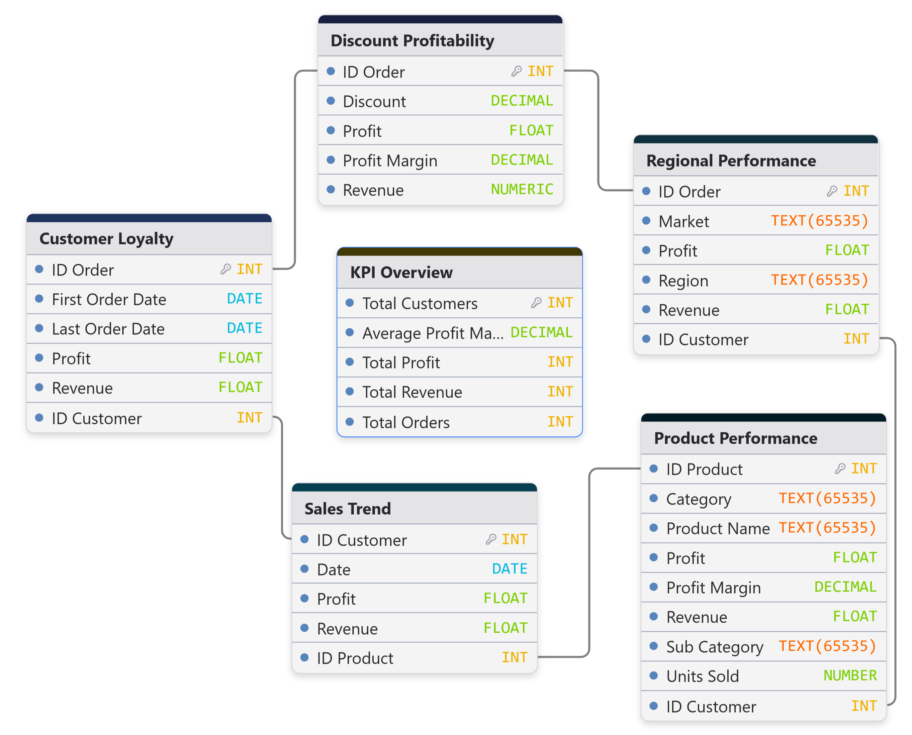
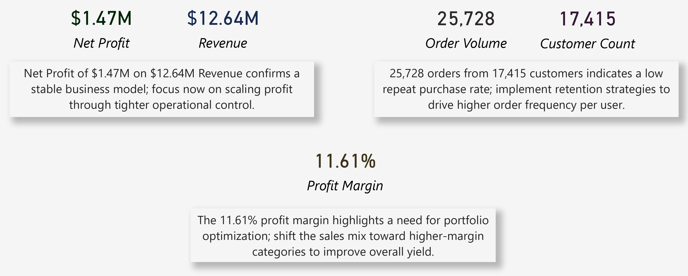
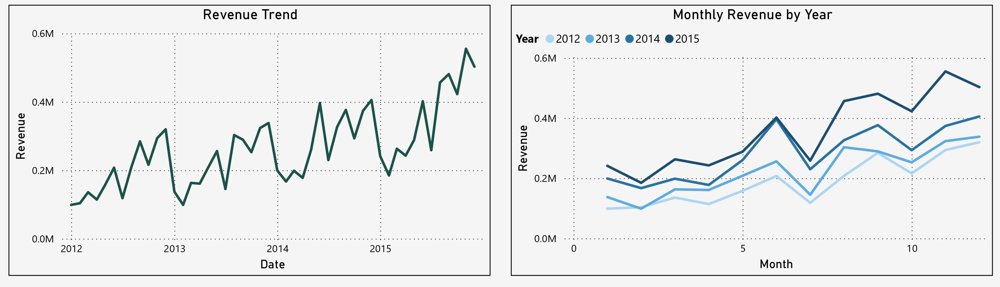
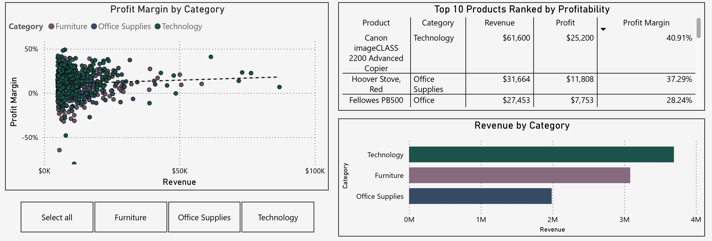
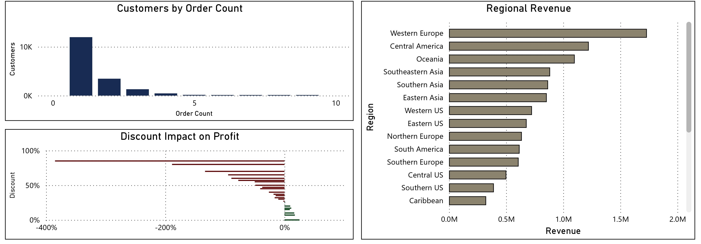

# Project Background
Global Superstore is a global retail giant specializing in three primary product categories: Technology, Furniture, and Office Supplies. Serving a diverse customer base across dozens of countries, the company operates on a high-volume, multi-region business model.

Despite achieving a total revenue of $12.64M, the business faces challenges regarding customer retention and the erosion of margins due to aggressive discounting. This analysis aims to provide the executive team with a roadmap for scaling profit through operational efficiency and targeted marketing.

Insights and recommendations are provided on the following key areas:

- **Sales Performance & Growth Trends:** Evaluation of year-over-year (YoY) revenue trajectories and seasonality.

- **Product Profitability & Portfolio Mix:** Analysis of which categories drive yield versus those that drain resources.

- **Customer Loyalty & Retention:** Examination of order frequency and the lifetime value of the current customer base.

- **Regional Operations & Discounting Strategy:** Identification of high-performing geographies and the impact of price reductions on the bottom line.

The SQL queries used to inspect and clean the data for this analysis can be found here .

Targeted SQL queries regarding various business questions can be found here .

An interactive Power BI dashboard used to report and explore sales trends can be found here .

# Data Structure & Initial Checks

The Global Superstore database consists of a primary transactional table supported by relational dimensions, totaling approximately 51,000+ records.
These files represent the cleaned and transformed data used for final visualization and insight generation:

- **KPI Overview Table:** High-level summary metrics containing total sales, total profit, and average order values across the entire 2012–2015 period.

- **Monthly Sales Trend Table:** Time-series data organized by month and year, used to track seasonality and YoY growth trajectories.

- **Product Performance Table:** Granular data at the category and sub-category level, detailing the profitability and revenue of specific stock units (SKUs).

- **Regional Performance Table:** Geographic data mapping sales and profit margins across various global regions and countries.

- **Discount Profitability Table:** A specialized dataset focusing on the correlation between discount percentages and net profit margins.

- **Customer Loyalty Table:** Customer-centric data tracking order frequency and purchase counts to analyze retention rates.

# Executive Summary

### Overview of Findings

Global Superstore is experiencing healthy top-line growth, culminating in $12.64M in revenue with a consistent upward trend through 2015. However, the 11.61% profit margin is currently suppressed by a high volume of single-purchase customers and "loss-leader" discounting strategies that frequently result in negative margins, particularly in the Furniture category. To scale, the company must pivot from aggressive acquisition to a retention-based model while tightening discount controls in underperforming regions.

# Insights Deep Dive
### Sales Performance & Growth Trends:

* **Strong YoY Momentum:** Revenue has scaled significantly from 2012 to 2015, with the "Revenue Trend" chart showing a clear upward trajectory.

* **Cyclical Seasonality:** There is a recurring peak in revenue during Q4 (Months 10–12) each year. November consistently represents the highest-earning month, likely driven by holiday demand and end-of-year corporate procurement.

* **Growth Stability:** The "Monthly Revenue by Year" chart confirms that each year's baseline is higher than the previous, indicating that the company is successfully capturing new market share.

* **Revenue Concentration:** Technology is the primary revenue driver at nearly $4M, followed closely by Furniture.

### Product Profitability & Portfolio Mix:

* **Technology Leads Yield:** The Canon imageCLASS 2200 is the most profitable individual product, boasting a 40.91% profit margin.

* **Furniture Margin Compression:** While Furniture generates high revenue (approx. $3M), the "Profit Margin by Category" scatter plot reveals a high concentration of Furniture items falling below the 0% profit line.

* **Optimization Opportunity:** Office Supplies represent the lowest total revenue but offer stable, consistent margins. Shifting the sales mix to emphasize high-margin Office Supply "staples" could stabilize the bottom line.

* **Profit Variance:** The scatter plot shows significant variance in profit for low-revenue items, suggesting that small-scale orders are often inefficiently priced.

### Customer Loyalty, Regional Operations & Discounting Strategy:

* **The "One-and-Done" Problem:** Of the 17,415 total customers, the "Customers by Order Count" histogram shows that the vast majority have only placed a single order.

* **Low Retention Rates:** There is a sharp drop-off after the second order. Very few customers reach the "5+ orders" threshold, which is where the highest ROI is typically realized.

* **Revenue Efficiency:** The current model relies heavily on the constant acquisition of new customers (Total orders: 25,728) rather than the cheaper alternative of selling to existing ones.

* **Untapped Potential:** If the repeat purchase rate were increased by even 10%, the reduced acquisition costs would directly improve the 11.61% net profit margin.

* **Western Europe Dominance:** Western Europe is the top-performing region, generating over $1.5M in revenue.

* **Regional Imbalance:** Revenue in the Caribbean and Southern US lags significantly behind, suggesting either a lack of market penetration or intense local competition.

* **The Discount Trap:** The "Discount Impact on Profit" chart shows a devastating correlation: once discounts exceed 20%, profit margins begin to plummet.

* **Extreme Losses:** Discounts at the 80% level result in a nearly -400% profit hit on those specific line items, indicating that current clearance or promotional strategies are fundamentally "breaking" the profit model.

# Recommendations:

Based on the insights and findings above, we would recommend the Executive and Marketing teams to consider the following:

* Implement a Loyalty Program
**Given the high volume of single-purchase customers, a rewards program should be launched to incentivize a second purchase within 90 days of the first. This will lower customer acquisition costs (CAC) and increase Lifetime Value (LTV).**

* Tighten Discount Guardrails
**Data shows that discounts >20% are destructive to profit. Establish a hard cap on discretionary discounts for sales representatives, requiring managerial approval for anything over 15%.**

* Furniture Portfolio Audit
**The Furniture category has the highest density of negative-margin products. Conduct a SKU-level rationalization to remove or reprice bulky, low-margin furniture items that are expensive to ship.**

* Capitalize on Q4 Seasonality
**With a clear revenue peak in November and December, reallocate marketing spend from Q1 to Q3 to build a "lead pipeline" that can be closed during the high-intent Q4 window.**

* Regional Expansion in Western Europe
**As the highest-revenue region with proven demand, consider localized distribution centers in Western Europe to further reduce shipping costs and improve delivery speed.**

# Assumptions and Caveats:

Throughout the analysis, multiple assumptions were made to manage challenges with the data. These assumptions and caveats are noted below:

* Currency Conversion: All financial figures are assumed to be converted to USD at the historical rate at the time of the transaction.

* Shipping Costs: Net profit calculations assume that shipping costs were deducted; however, if shipping was subsidized by the company, it may account for the negative margins seen in the "Discount Impact" chart.

* Data Completeness: The analysis assumes that "Returned" orders have been excluded from the total revenue and profit figures to avoid overstating performance.
